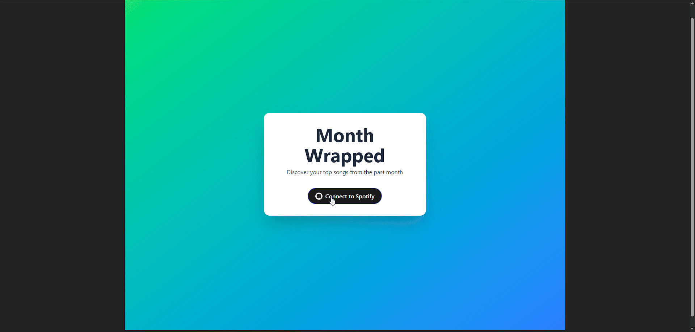

# Month Wrapped - Spotify Top Songs

A React application that connects to Spotify API to display your top 5 songs from the past month.

> **Note**: Due to Spotify's recent API quota changes (May 2025), this app may have limited functionality. See [quota documentation](https://developer.spotify.com/documentation/web-api/concepts/quota-modes) for details.

## Demo

*Connect to Spotify and see your top 5 songs from the past month*

## Technologies Used

### Frontend
- **React 19** - Modern React with hooks and functional components
- **Vite** - Fast build tool and development server
- **Typescript** - Static typing for JavaScript
- **Tailwind CSS** - Utility-first CSS framework for styling

### Backend
- **Node.js** - JavaScript runtime environment
- **Express.js** - Web application framework
- **Axios** - HTTP client for API requests
- **JWT (jsonwebtoken)** - JSON Web Token authentication

### External APIs
- **Spotify Web API** - Music data and user authentication

### Deployment & Infrastructure
- **Render** - Cloud hosting platform (referenced in backend URL)
- **Vercel** - Cloud hosting platform (referenced in frontend URL)

